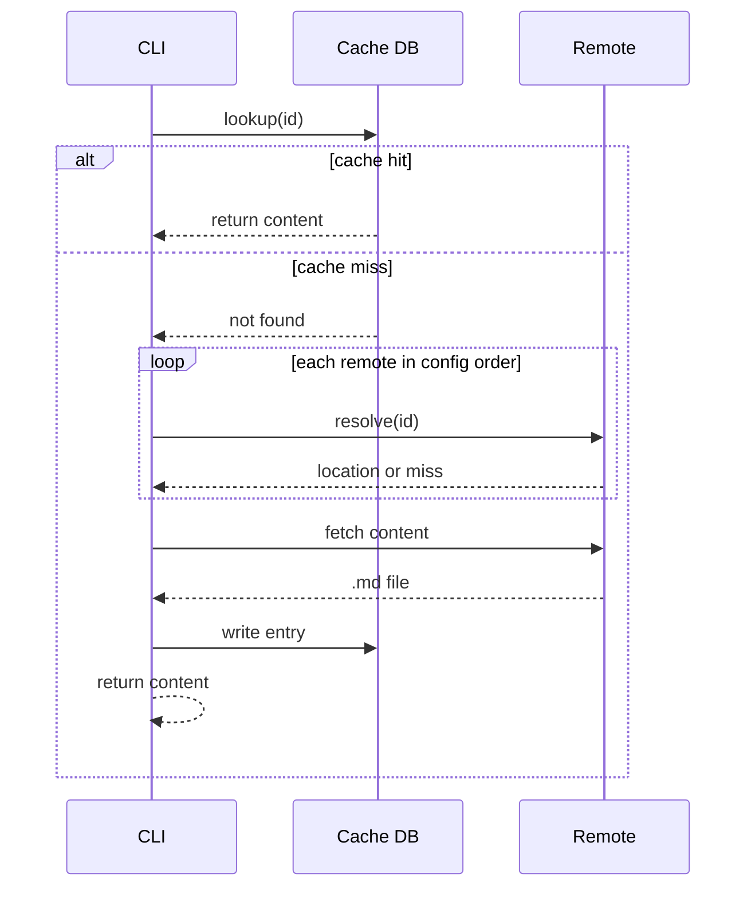

_See also: [Discovery](discovery.md) · [User Flows](user-flows.md)_

Stable contracts for the Corpo protocol. All implementations — CLI, GUI,
adapters — must conform to these primitives.

---

## Definitions

| Term | Definition |
|---|---|
| **File** | A Markdown file with YAML frontmatter, named `{file-id}.md`. Files are either **local** (stored in `.corpo/files/`) or **remote** (fetched from an external source). |
| **Thread** | An inline comment thread attached to a position in a file's body. |
| **Remote** | A location from which remote files are fetched. Either a git repository (`git:github.com/{owner}/{repo}.git`) or a registry — an HTTP service implementing the Corpo registry API. |

---

## 1. File Format

Every Corpo file is a Markdown file with a YAML frontmatter block. The
frontmatter is the machine-readable metadata layer; the Markdown body is the
human-readable content.

### 1.1 Frontmatter

The frontmatter block is delimited by `---` and appears at the top of the
file. It has two distinct sections: core metadata and threads. Implementations
and agents may parse these independently.

**Full example:**

```yaml
---
title: "Why we should change the fee model"
description: "A concise plain-text summary of this file. Capped at 1024
  characters. Written for agents and humans skimming the files."
import: https://docs.google.com/...

threads:
  3a7f2b9c:
    author: conner
    at: 2026-03-07T14:23Z
    body: "Does this hold at p99 or just p50?"
    replies:
      - author: mara
        at: 2026-03-07T15:00Z
        body: "p50 only, p99 needs more data."
---
```

#### Core metadata fields

| Field | Required | Description |
|---|---|---|
| `title` | Yes | Human-readable file name |
| `description` | Yes | Plain text summary, max 1024 characters |
| `sidebarTitle` | No | Short label shown in the sidebar. Falls back to `title` if absent. |
| `import` | If imported | Original URL of the imported file |

`sidebarTitle` is a display hint for viewers and editors. It does not affect
file identity, search, or agent-facing metadata. Display label resolution order:
navigation config explicit label → `sidebarTitle` → `title`.

`import` must be present when the file was created via `corpo import`. It
enables deduplication: the CLI warns before creating a new file if one with
the same `import` URL already exists in any configured directory.

**Unknown fields** are silently ignored by all implementations. This enables
forward compatibility as the protocol evolves.

#### Threads

`threads` is a top-level frontmatter key containing all active comment threads
on the file. It is intentionally separated from core metadata so that
implementations and agents can parse one without the other.

```yaml
threads:
  {thread-id}:
    author: username
    at: 2026-03-07T14:23:00Z    # ISO 8601
    body: "Thread body text."
    replies:                     # optional, defaults to []
      - author: username
        at: 2026-03-07T15:00:00Z
        body: "Reply text."
```

**Thread ID:** 8-character random hex string (`[0-9a-f]`), scoped to the
file. Space: 16^8 ≈ 4.3 billion per file.

**Replies** are an ordered list with no IDs. They have no addressable global
reference — only threads are linkable.

**Progressive disclosure:** The CLI supports field-level selection so agents
can read only what they need:

```
corpo read {id} --fields title,description   # core metadata only
corpo read {id} --no-threads                 # metadata + body, no threads
corpo read {id} --thread {thread-id}         # a single thread by ID
```

### 1.2 Thread Anchors

Each thread has an anchor in the Markdown body that marks its position. The
anchor is an HTML comment — invisible to all Markdown renderers, unambiguous
to parse.

```markdown
We should default to option B based on the latency data.

<!-- thread:3a7f2b9c -->

Further analysis shows that option A has higher p99 latency.
```

**Anchoring rule:** A thread is associated with the content immediately
preceding its anchor comment in the file body.

**Global reference:** `corpo.sh/{file-id}#thread:{thread-id}` — a stable
hyperlink to a specific thread, usable from any file or external system.

**Positioning across diffs:** Anchors move with their surrounding content
when the file is edited. Because anchor position (body) and thread content
(frontmatter) are stored separately, content edits and reply additions produce
independent, non-overlapping diffs.

### 1.3 Thread Resolution

When a thread is resolved or deleted:

1. The `<!-- thread:{id} -->` line is removed from the file body
2. The `threads.{id}` entry is removed from frontmatter

Resolved threads are preserved in git history. The corpo.sh backend may
additionally cache resolved thread data at resolution time to keep persistent
links (`corpo.sh/{file-id}#thread:{id}`) valid without requiring a git
traversal.

---

## 2. File Collection

A `.corpo` directory contains two kinds of files: **local files** that live in
`.corpo/files/`, and **remote files** declared in `.corpo/config.json` that are
fetched from external sources on demand.

### 2.1 File Naming and IDs

Every Corpo file is named `{file-id}.md`. The filename is the file ID —
there is no `id` field in the frontmatter.

**ID format:** UUID v4, stripped of hyphens. 32 lowercase hex characters,
charset `[0-9a-f]`.

```
Charset:  0 1 2 3 4 5 6 7 8 9 a b c d e f
Length:   32 characters
Example:  550e8400e29b41d4a716446655440000
Space:    2^128 ≈ 3.4 × 10^38 (globally unique without coordination)
```

IDs are assigned at creation time and stable forever — renaming, moving, or
archiving a file never changes its ID. The filename changes; the ID does not.

**Persistent link:** `corpo.sh/{file-id}` — globally unique by construction.

### 2.2 Config

`.corpo/config.json` governs the directory. `corpo init` creates the `.corpo/`
directory and both files within it.

```
.corpo/
  config.json
  files/
    {file-id}.md
```

```json
{
  "remote_files": {
    "a1b2c3d4e5f6a7b8c9d0e1f2a3b4c5d6": "git:github.com/mycompany/platform.git",
    "b2c3d4e5f6a7b8c9d0e1f2a3b4c5d6e7": "https://corpo.sh"
  },
  "navigation": [
    {
      "group": "Product",
      "children": [
        "550e8400e29b41d4a716446655440000",
        "3f7a9b2c1e4d5f6a7b8c9d0e1f2a3b4c",
        { "group": "Discovery", "children": ["9a1b2c3d4e5f6a7b8c9d0e1f2a3b4c5d"] }
      ]
    },
    {
      "group": "Engineering",
      "children": ["a1b2c3d4e5f6a7b8c9d0e1f2a3b4c5d6"]
    }
  ]
}
```

| Key | Description |
|---|---|
| `remote_files` | Maps remote file IDs to their remote identifier (`git:...` or `https://...`). Each entry fully specifies where to fetch the file. |
| `navigation` | Optional. Recursive tree of nodes. Each node is either a file ID (string) or a group object `{ group, children: Node[] }`. Files and subgroups can appear in any order. Depth is unrestricted. |

**Local files** live in `.corpo/files/`. The CLI discovers them by scanning
`.corpo/files/*.md`. No manifest entry is required — drop a file in the
directory and it is part of the collection. Add it to `navigation` to surface
it in the sidebar.

**Remote files** are declared in `remote_files`. For git remotes, the CLI
fetches `.corpo/config.json` from the remote repo and lists the remote tree
to locate `.corpo/files/{file-id}.md`. The resolved path is written to the
cache; subsequent reads use the cached path directly.

**Navigation** is the single source of truth for sidebar structure for both
local and remote files. Local and remote file IDs are identical entries — no
distinction in syntax. Files not listed in `navigation` are accessible by ID
but absent from the sidebar. The first file listed in the first group is the
implicit starting point for agents and humans orienting on the files.

**CLI discovery**: the CLI walks up from the current working directory looking
for `.corpo/config.json`, the same way git locates `.git/`. This allows
running corpo commands from any subdirectory of the repo.

`corpo add {id}` appends to `remote_files` with the resolved remote as its
value. Corpo links encountered in files, code, or agent tool calls are
auto-added to `remote_files` — but not immediately fetched. Content is fetched
on next explicit read or `corpo sync`.

---

## 3. Cache and Sync

The CLI stitches together local and remote sources through a user-level cache.
All cached content lives at the user level — there is no per-directory data store.

### 3.1 Remote Types

**ID = identity. Remote = routing.**

A file ID is globally unique and permanent. Where a file is fetched from is a
routing concern that lives in config and cache — never in the reference itself.
A file can migrate between remotes without breaking any existing reference.

The protocol defines two remote types. Remotes are listed in config in
priority order; the CLI tries them in order for deterministic, predictable
resolution.

**Git remote** — direct access to a git hosting provider via its native API.
No intermediary. Content is fetched using existing credentials. Format mirrors
SSH clone URLs.

```
git:github.com/{owner}/{repo}.git
git:gitlab.com/{owner}/{repo}.git
```

**Registry remote** — an HTTP endpoint implementing the Corpo registry API
spec. Any backend (git-backed, database-backed, search-indexed) can implement
this spec and become a valid Corpo registry.

```
https://corpo.sh
https://docs.acme.com
```

The registry API is minimal:

```
GET /file/{id}          → title, description, remote_type, remote_ref, path
GET /file/{id}/content  → raw .md file content
```

### 3.2 User Config

`~/.corpo/config.json` defines the user-level defaults applied in all
contexts. It declares remotes only — the cache DB is the canonical record of
which files are locally available.

```json
{
  "remotes": [
    "git:github.com/ilikesymmetry/corpo.git",
    "https://corpo.sh"
  ]
}
```

`remotes` is an ordered list of remotes the CLI tries during resolution,
applied as a fallback when no `.corpo/config.json` is present or when an ID
is not found in `remote_files`.

### 3.3 Cache Layout

```
~/.corpo/
  config.json        # user config: remotes
  cache.db           # SQLite: all fetched files, metadata, blob SHA
  files/
    {file-id}.md     # full content, written on fetch
```

### 3.4 Cache Database

`~/.corpo/cache.db` is a SQLite database. Core schema:

```sql
CREATE TABLE files (
  id           TEXT PRIMARY KEY,
  remote_type  TEXT NOT NULL,   -- 'git' | 'registry'
  remote_ref   TEXT NOT NULL,   -- e.g. 'git:github.com/ilikesymmetry/corpo.git' or 'https://corpo.sh'
  path         TEXT NOT NULL,   -- full path as it appears locally or on remote, for display
  title        TEXT NOT NULL,
  description  TEXT NOT NULL,
  import       TEXT,            -- original URL if created via `corpo import`, null otherwise
  blob_sha     TEXT NOT NULL,
  fetched_at   INTEGER NOT NULL
);
```

The cache is binary: a file is either fully cached or not present. There is no
partial state. `path` is cached for display purposes and for subsequent fetches
— it records where the file was found in the remote (git tree path or registry
path). On first fetch, git remotes discover the path by listing the remote
tree; registry remotes use their API. All subsequent reads use the cached path
directly.

### 3.5 Fetch Triggers

A fetch is triggered by:
- Explicit read (`corpo read {id}`)
- Agent content request
- `corpo sync` for any file in `.corpo/config.json` `remote_files` not yet in cache

On fetch:
- Downloads the full `.md` file
- Writes to `~/.corpo/files/{file-id}.md`
- Writes a complete DB row including `blob_sha` and `fetched_at`

Encountered Corpo links (in files, code, or agent tool calls) are auto-added
to `.corpo/config.json` `remote_files` but not immediately fetched. Fetch
happens on next explicit read or sync.

### 3.6 Staleness and Sync

**Git remotes** — `corpo sync` uses the remote repo's commit SHA as a
short-circuit:

1. Fetch the latest commit SHA for the remote repo (1 API call)
2. If unchanged since last sync → all files from that remote are fresh, skip
3. If changed → for each cached file from that remote, compare the file's
   blob SHA against the cached `blob_sha`
4. Download only files where SHA differs

**Registry remotes** — `corpo sync` calls `GET /file/{id}` for each cached
file from that remote and re-fetches if `blob_sha` differs. No index involved.

When the CLI detects `.corpo/config.json`, it background-syncs all files in
`remote_files`. Reads are never blocked — cached content is served immediately
while background updates land.

### 3.7 Resolution Algorithm

Given a file ID, the CLI resolves it in strict order:

1. **Cache hit**: return content immediately. No network call.
2. **Cache miss — discovery**: try each remote in config order until a match
   is found. First hit wins. Fetch full content and write to cache.
3. **Not found**: error.

After step 2, the resolved remote is stored in the cache. All subsequent reads
for that ID go directly to step 1.



Write operations (`corpo publish`, `corpo reply`) go directly to the remote
via git host API. The CLI immediately updates the DB row and local file after
a successful write.

---

## 4. Auth

Auth is a pluggable primitive. The protocol defines extension points; it does
not mandate a specific implementation.

**Extension points:**
- **Read auth** — controls who can resolve a persistent link at corpo.sh
- **Write auth** — controls who can commit changes (enforced by GitHub)
- **GUI auth** — controls access to the rendered browser view

**Implementations, in order:**

1. **GitHub OAuth** — repo visibility is file visibility. Public repo: no
   login. Private repo: GitHub login required, access mirrors repo permissions.
2. **Okta SSO (SAML)** — for enterprise orgs.
3. **Repo-level access tokens** — for CLI and agent access without a browser
   session.
